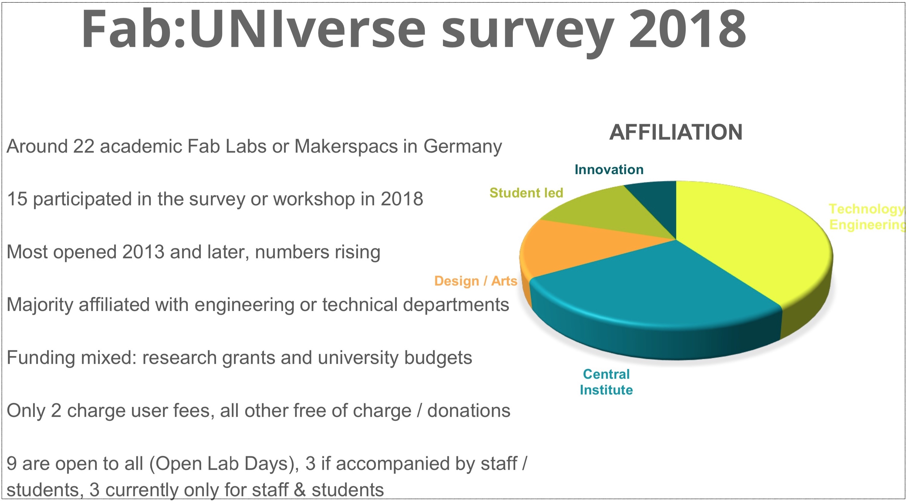

## Workshop Invitation

For [FabLearn Europe 2019](http://fablearn.eu/), we invite Lab managers, practitioners and other stakeholders of academic Fab Labs in Europe for a  gathering. We will share and discuss learnings from our own recent participatory and managerial work in/with four German academic Fab Labs - and we hope *you* will share your experiences with establishing and sustaining an academic (Fab) Lab with us as well. The workshop will also be an opportunity to discuss more cooperation between European academic (Fab) Lab managers / operators and existing related channels, communities, events or projects.

## Background

Fab Labs and 'Maker' practices have been recognized in research and practice as contexts that facilitate creativity, knowledge sharing and collaboration. Personal digital fabrication is getting increasing attention from various fields like education, engineering, innovation, design, humanitarian aid or regional development. However, integrating Fab Lab environments into academic education is still challenging in practice. In Germany, more than 200 such creative community spaces exist; around 15 of these are associated with universities. Most are initiated and run by single entities such as student groups or university chairs and are not integrated in the universities' overall organizational matters.

Federal research project [FAB101](https://fab101.de) aims to consolidate organizational and educational knowledge based on experiences in four Fab Labs at German universities to inform and help further development of Fab Labs in Academia. Part of the project is also supporting exchange between Fab Labs in academic contexts. For [2018](/fabuniverse-2018) and [2019](/fabuniverse-2018), this has included hosting the Fab:UNIverse workshop founded in 2017 by TH Wildau as a forum for German academic Lab managers. At Fab:UNIverse 2018, such managers from 13 universities came together to discuss and share knowledge on governance, infrastructure, educational and other operative matters. We hope, FabLearn 2019 can be an opportunity to expand our dialogue on an European level.

## Preparation Survey

For Fab:UNIverse 2018, we created a preparatory survey that helped guide the discussion at the workshop itself. We invite all academic (Fab) Lab practitioners to [take an international version of this survey](TODOLINKHERE) as well to prepare for the FabLearn 2019 workshop. A survey link will also be distributed via e-Mail by the conference organizes.

## Program Draft

**Date: May 28th or May 29th of May**  

**Location: University of Oulu, Finland**

In research project FAB101, we have identified four core domains framing academic Fab Labs: Educational concepts, Infrastructure, Collaboration and Governance. We will start our workshop with a presentation and brief discussion of preliminary results along those domains and compare them to the results of our survey among FabLearn 2019 participants.

The introduction will be followed by a more interactive creative session. The goal here will be to collect (more) experiences along the aforementioned domains on an European level as well as to confirm, challenge and complement them. Depending on participants, the following areas could be addressed in the session:

* Educational concepts: Courses offered in / with help of a Fab Lab; questions regarding safety & competences, creditation, transdisciplinarity and didactic requirements
* Infrastructure: State of practice vs. MIT Fab Inventory; spatial design; location; size; open source / open hardware; integration with other Labs
* Collaboration & Sharing: Differences in individual projects / Lab Community / public sharing and collaboration; community management; interdisciplinary research & teaching in a Fab Lab; existing Lab manager communities, events & networks
* Governance: Status and organizational forms of Labs within a university; funding structure; integration into city/region; services; team structure

The creative activity will be followed by a short discussion and contextualization session as well as a wrap-up.

## Intended Outcomes

All data from the workshop will be shared directly with the workshop participants after the event. In the longer term, the data will also be considered in an upcoming (openly licensed) handbook from research project FAB101 aimed at helping (public) organizations interested in establishing a Fab Lab.  

Complementing the interest in collecting useful data for people creating, managing and sustaining academic Fab Labs, we are also interested in opportunities to connect them. The global [FAB Conference](https://fabevent.org/) series certainly is the core event for such connections. However, we believe there should be more opportunities on national and European levels to connect and share meta- and management-knowledge about running (Fab) Labs in and with (public) organizations. We hope FabLearn 2019 can be such an opportunity and also help in identifying and collecting upcoming or existing related opportunities, networks, events and communities.  

## Documentation & Photos

tbd after the event.

## Organizers

Oliver Stickel (Uni Siegen), Melanie Stilz (Uni Siegen, TU Berlin), Anke Brocker (RWTH Aachen), Jan Borchers (RWTH Aachen), Volkmar Pipek (Uni Siegen). [Contact Details here](/kontakt).

