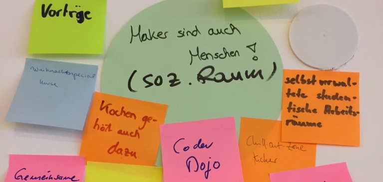
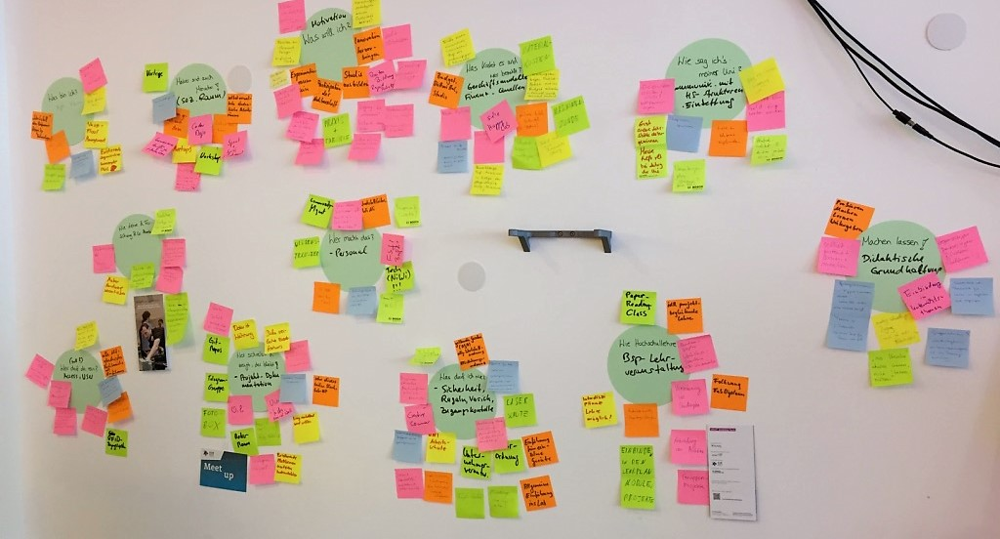
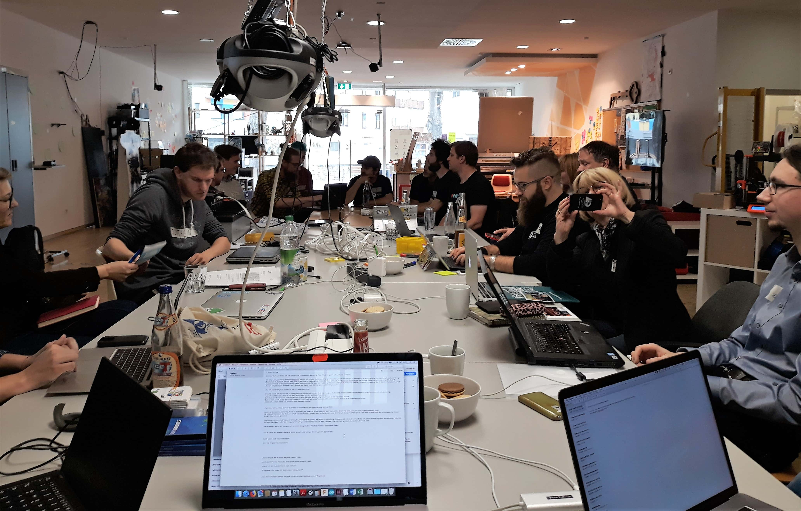

## Hintergrund

Mit der Einrichtung und dem Betrieb von Fab Labs und ähnlichen Laboren sind eine ganze Menge Herausforderungen verbunden. Weltweit gibt es einige Netzwerke, die Unterstützung bei und Kommunikation über solche Herausforderungen ermöglichen - bisher allerdings nicht spezifisch für den deutschen Hochschulkontext. 2017 riefen die KollegInnen von der TH Wildau und dem dortigen [ViNN:Lab](http://vinnlab.th-wildau.de/de/vinnlab-de/) zum Fab:UNIverse-Workshop auf, der einen wichtigen Startpunkt für mehr Vernetzung dieser Hochschul-Labs setzte. Ausgehend vom Projekt FAB101, das sich spezifisch mit der Rolle von Fab Labs in der deutschen Hochschullandschaft befasst, können wir nun auf das Konzept aufbauen und werden Fab:UNIverse 2018 und 2019 organisatorisch mittragen. Alle Fab Labs und Makerspaces an / bei deutschen Hochschulen sind hiermit herzlich eingeladen, zum  Programm zu diskutieren und beizutragen!

## Programm 2018

**Datum: Fr. 19.10.2018**

13:00 - 14:00	Begrüßung und Vorstellung  
14:00 - 15:00	Sammlung & Clustering

15:00 - 15:30	Pause

15:30 - 16:30	Vertiefung 1 (z.B. Lehre in und mit (Fab) Labs: Beispiele, Erfahrungen, Entwicklungen)   
16:30 - 17:30	Vertiefung 2 (z.B. Verortung, Governance und Organisation von Fab Labs an Hochschulen)

17:30 - 18:00	Wrap-Up  
Ab 18:00	Socializing, BBQ & Party im Fab Lab Siegen

## Ort und Anfahrt

Im [Fab Lab Siegen](https://fablab-siegen.de/kontakt). **Anschrift:** Herrengarten 2, 57072 Siegen

<iframe width="680" height="350" frameborder="0" scrolling="no" marginheight="0" marginwidth="0" src="https://www.openstreetmap.org/export/embed.html?bbox=8.017071783542635%2C50.87442934078058%2C8.02232623100281%2C50.87659234792912&amp;layer=mapnik&amp;marker=50.875510856903745%2C8.01969900727272"></iframe> <small><a href="http://www.openstreetmap.org/?mlat=50.87551&amp;mlon=8.01970#map=19/50.87551/8.01970">Karte auf openstreemap.org anzeigen</a></small>

## Anmeldung

Wir bitten um *Anmeldung bis zum 19.09.2018* an [melanie.stilz@uni-siegen.de](mailto:melanie.stilz@uni-siegen.de). Hier könnt Ihr gerne auch noch eigene Vorschläge zum Programm einbringen!

## Vorbereitung und Beiträge

Für die Vorstellungsrunde bitten wir um Vorbereitung von 3-5 Slides / Illustrationen, wobei insbesondere folgende Punkte von Interesse sind:

- Entstehung des jeweiligen Labs
- Grobe Organisationsstruktur und Verortung an der Hochschule
- Involvement in Lehre und Forschung
- Regionale und globale Verankerung und Kooperationen
- Bild- / Videomaterial zu euren Labs und Communities

## Bilder Fab:UNIverse 2018

## Organisation

Oliver Stickel (Gründer / Manager Fab Lab Siegen & Forscher Uni Siegen) und Dr. Melanie Stilz (Managerin ArTe-Lab TU Berlin & Post-Doc Uni Siegen).
