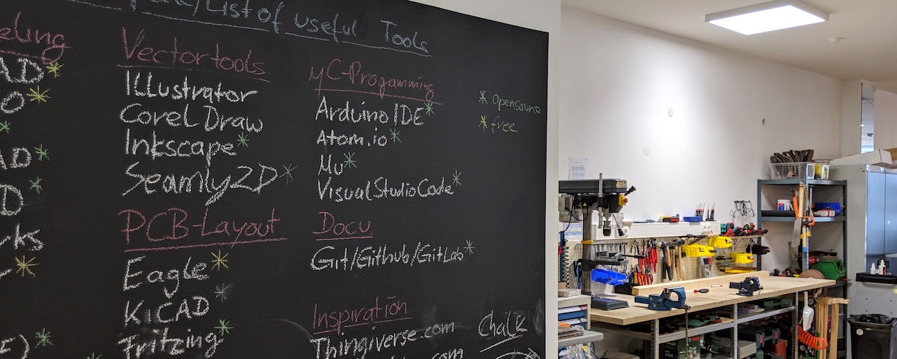

## Übersicht über Fab Labs und vergleichbare Orte an deutschen Hochschulen (work in progress...)
Dank der Teilnahme zahlreicher Hochschulen an unseren Umfragen und Workshops rund um Fab:UNIverse konnten wir eine recht beeindruckende Liste zusammenstellen welche Fab Labs und vergleichbare Orte an deutschen Hochschulen bereits existieren und/oder in Planung sind:

**Wir freuen uns über Ergänzungen, Korrekturen & Updates**

| Hochschule        | Name          | Angliederung | Finanzierung | Zugang | Lehre  |
| ------------- |:-----------------|:-------------|:--------------|:-------------|:-------------|  
| RWTH Aachen   | [Fab Lab Aachen](http://fablab-aachen.de) | Angliederung | Finanzierung | Zugang | Lehre  |
| Hochschule Augsburg | [Fablab](https://www.hs-augsburg.de/Informatik/FabLab.html)  | Angliederung | Finanzierung | Zugang | Lehre  |
| Beuth Hochschule     | [Labor für Fertigungsverfahren der Mechatronik](https://labor.beuth-hochschule.de/fvm/fertigung/mechanische-fertigung/)| Angliederung | Finanzierung | Zugang | Lehre  |
| TU Berlin       | [do it yourself & mechatronics lab](http://tatendrang.tu-berlin.de/wp/projekte/diy-mechatronics-lab/)| Studierendenprojekt / formell Institut für Berufliche Bildung und Arbeitslehre | Finanzierung | Zugang | Lehre  |
| Rhur Universität Bochum  | [MakerForum](https://www.worldfactory.de/makerforum) | Angliederung | Finanzierung | Zugang | Lehre  |
| Hochschule Rhur West |[HRW FabLab](http://hrw-fablab.de/)| Angliederung | Finanzierung | Zugang | Lehre  |
| TH Brandenburg     | [Offene Werkstatt](https://offene-werkstatt.th-brandenburg.de/die-werkstatt/?S=814) | Angliederung | Finanzierung | Zugang | Lehre  |
| Ostfalia Hochschule für angewandte Wissenschaften | [FabLab](https://www.ostfalia.de/cms/de/zaf/taetigkeit/fablab-38/) | transdisziplinäres Zentrum für additive Fertigung (ZaF) | Keine Angaben |Studierende und Mitarbeiter. Externe nach Absprache | Keine Angaben dazu |
| Universität Bremen | [TechKreativ](http://dimeb.informatik.uni-bremen.de/techkreativ/)| Angliederung | Finanzierung | Zugang | Lehre  |
| FH Bremerhaven  | [Fährhaus](https://www.hs-bremerhaven.de/service/standort/faehrhaus/) | Angliederung | Finanzierung | Zugang | Lehre  |
|Hochschule Coburg | [CREAPOLIS](https://www.hs-coburg.de/ueber-uns/profil/creapolis.html#c6713)| Angliederung | Finanzierung | Zugang | Lehre  |
|TU Darmstadt| [FabLab Darmstadt](https://www.fablab.tu-darmstadt.de/fablab_classic/lab_classic/index.de.jsp) | Angliederung | Finanzierung | Zugang | Lehre  |
|TH Ostwestfalen-Lippe  | [FABLAB OWL](https://www.th-owl.de/fablab/)|Angliederung | Finanzierung | Zugang | Lehre  |
|TU Dortmund | [SELFMADE] (http://www.selfmade.fk13.tu-dortmund.de/cms/de/SELFMADE/) | Angliederung | Finanzierung | Zugang | Lehre  |
|TU Dresden | [SLUB Makerspace](https://www.slub-dresden.de/service/arbeitsplaetze-arbeitsraeume/makerspace/) | Angliederung | Finanzierung | Zugang | Lehre  |
|Universität Duisburg-Essen | Name          | Angliederung | Finanzierung | Zugang | Lehre  |
|Hochschule Emden | Name          | Angliederung | Finanzierung | Zugang | Lehre  |
|Friedrich-Alexander-Universität Erlangen-Nürnberg | Name          | Angliederung | Finanzierung | Zugang | Lehre  |
|Folkwang Universität der Künste | Name          | Angliederung | Finanzierung | Zugang | Lehre  |
|Hochschule Flensburg | FabLab Ideenreich | Angliederung | Finanzierung | Zugang | Lehre  |
|Hochschule Fulda | Name          | Angliederung | Finanzierung | Zugang | Lehre  |
|Westfählische Hochschule | Name          | Angliederung | Finanzierung | Zugang | Lehre  |
|Kunsthochschule Halle | Name          | Angliederung | Finanzierung | Zugang | Lehre  |
|Helmut-Schmidt-Universität| Name          | Angliederung | Finanzierung | Zugang | Lehre  |
|TU Hamburg | Name          | Angliederung | Finanzierung | Zugang | Lehre  |
|Duale Hochschule Baden-Württemberg| Name          | Angliederung | Finanzierung | Zugang | Lehre  |
|Universität Jena| Name          | Angliederung | Finanzierung | Zugang | Lehre  |
|Hochschule Rhein-Waal | Name          | Angliederung | Finanzierung | Zugang | Lehre  |
|Hochschule Konstanz | Name          | Angliederung | Finanzierung | Zugang | Lehre  |
|Universität zu Lübeck | Fab Lab Lübeck | Unabhängig, aber auf dem Campus | keine / eigenes Finanzkonzept | Freier Zugang während Öffnungszeiten bzw nach Einweisung | Kooperation mit Lehrbetrieb  |
|Otto von Guericke Universität| Name          | Angliederung | Finanzierung | Zugang | Lehre  |
|Hochschule Niederrhein | Name          | Angliederung | Finanzierung | Zugang | Lehre  |
|Hochschule Offenburg| Name          | Angliederung | Finanzierung | Zugang | Lehre  |
|Universität Passau| EISLab| Angliederung | Finanzierung | Zugang | Lehre  |
|Hochschule Bonn-Rhein-Sieg| Name          | Angliederung | Finanzierung | Zugang | Lehre  |
|Universität Siegen | Name          | Angliederung | Finanzierung | Zugang | Lehre  |
|Akademie der Bildenden Künste Stuttgart| Name          | Angliederung | Finanzierung | Zugang | Lehre  |
|Technische Hochschule Wildau| Name          | Angliederung | Finanzierung | Zugang | Lehre  |
|Hochschule        | Name          | Angliederung | Finanzierung | Zugang | Lehre  |
|Hochschule        | Name          | Angliederung | Finanzierung | Zugang | Lehre  |

## Das war Fab:UNIverse 2019
Vielen lieben Dank an alle, die da waren! Es war uns ein großes Vergnügen mit euch den Tag zu verbringen und zu arbeiten! Die Ergebnisse findet ihr ganz [unten auf dieser Seite](https://fab101.de/fabuniverse/#workshop-ergebnisse). Viel Spaß und bis zum nächsten Jahr!

## Hintergrund

Mit der Einrichtung und dem Betrieb von öffentlich zugänglichen Fab Labs, (Maker-)Spaces und ähnlichen Laboren im Hochschulkontext sind eine ganze Menge Herausforderungen verbunden. Dazu tauschen sich seit 2017 eine zunehmende Zahl an Vertretern solcher Orte in der jährlichen Veranstaltung Fab:UNIverse aus. Auch 2019 wollen wir wieder die Möglichkeit zu Vernetzung und Austausch von Hochschul (Fab) Labs bieten und diesmal auch die Ergebnisse des Forschungsprojektes FAB101 in Form eines Handbuchs für akademische Makerspaces präsentieren und zur Diskussion stellen.

Fab:UNIverse 2019 findet am 06.11.2019 ganztägig im Einstein Centre Digital Future (ECDF) im Herzen von Berlin statt. Aufgrund der begrenzten Plätze bitten wir um rechtzeitige *Anmeldung bis spätestens zum 15.10.2019* an [melanie.stilz@uni-siegen.de](mailto:melanie.stilz@uni-siegen.de). Am 5.11 ab 19h findet ein informelles Kennenlernen statt zu dem alle herzlich eingeladen sind, der Ort wird in Kürze bekannt gegeben.
Das vorläufige Programm:

## Programm 2019

**Datum: Mi. 06.11.2019**
Beginn: 9:00Uhr

| Zeit          | Programmpunkt          | 
| ------------- |:-----------------------| 
| 9:00          | Ankommen, Registrierung|
| 09:30         | Begrüßung              |
| 10:00         | Fab Labs als Hochschulinfrastruktur: Stand der Forschung |
| 11:00         | Kaffeepause           |
| 11:15         | Workshop Phase I|
| 12:30         | Mittagspause|
| 13:30         | Workshop Phase II|
| 15:00         | “One-Minute-Madness” - Lightning Talks|
| 15:30         | Kaffeepause|
| 16:00         | Vorstellung der Workshop-Ergebnisse|
| 16:45         | Podiumsdiskussion: "Hochschul-Digitalisierungsstrategie und Fab Labs"|
| 17:45         | Abschluss|

Ende: 18:00Uhr

## Ort und Anfahrt

Im [Einstein Center Digital Future](https://www.digital-future.berlin/) Berlin.

**Anschrift:** Wilhelmstraße 67, 10117 Berlin

<iframe width="680" height="350" frameborder="0" scrolling="no" marginheight="0" marginwidth="0" src="https://www.openstreetmap.org/export/embed.html?bbox=13.376508951187136%2C52.515933591762696%2C13.384029865264894%2C52.520862660627735&amp;layer=mapnik&amp;marker=52.518398195318696%2C13.380269408226013" style="border: 1px solid black"></iframe> <small><a href="https://www.openstreetmap.org/?mlat=52.51840&amp;mlon=13.38027#map=17/52.51840/13.38027">View Larger Map</a></small>

## Anmeldung und Beiträge

Wir bitten um *Anmeldung bis zum 15.09.2019* an [melanie.stilz@uni-siegen.de](mailto:melanie.stilz@uni-siegen.de). Hier bekommt ihr auch weitere Informationen zur Vorbereitung und Teilnahme.

## Organisation

## Keynote der Konferenz

Wir freuen uns euch allen die Keynote von Prof. Borchers zur Verfügung zu stellen: 
<a href="191106FabUniverseKeynoteBorchers.pdf" download>Click to Download</a>

## Workshop-Ergebnisse

Und hier nun wie versprochen die Ergebnisse unserer Workshops

### Governance

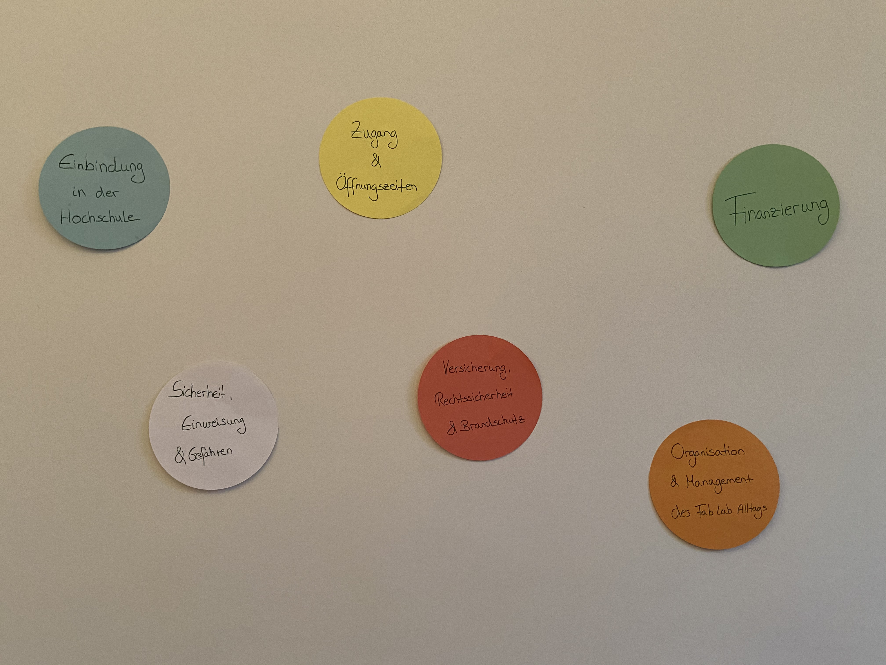

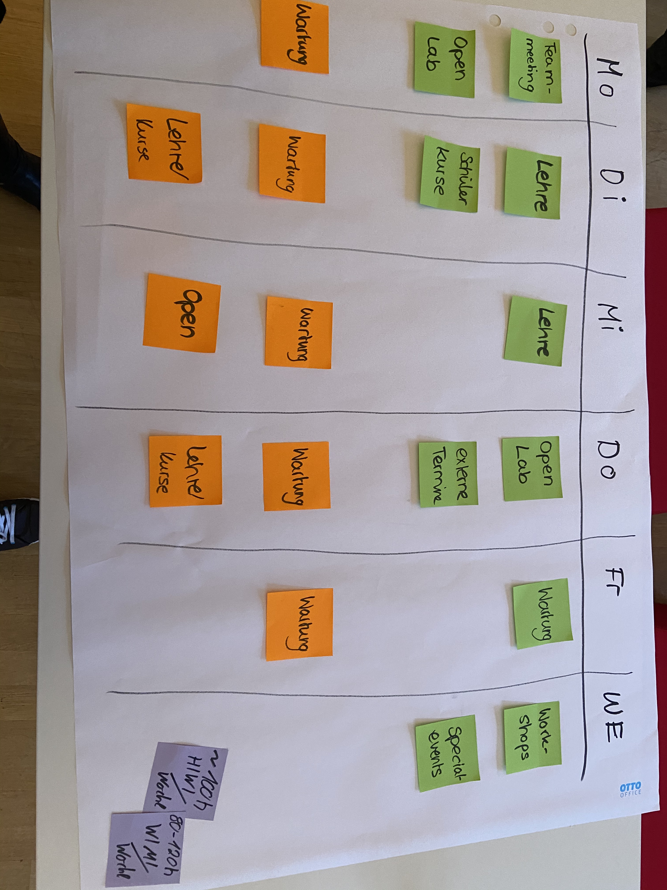

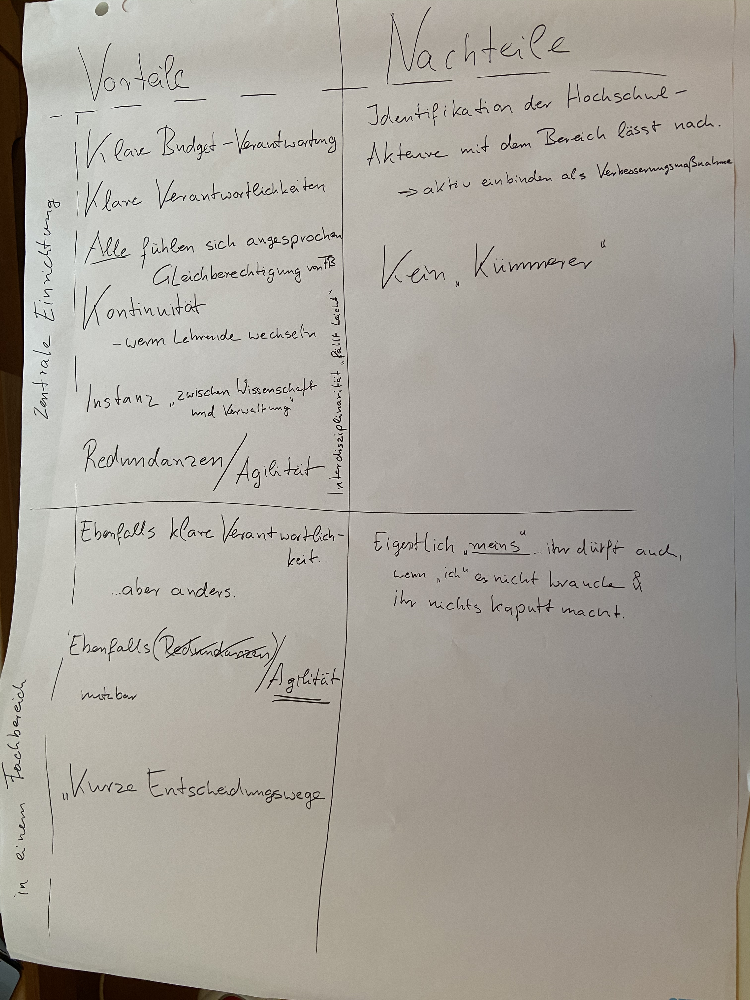

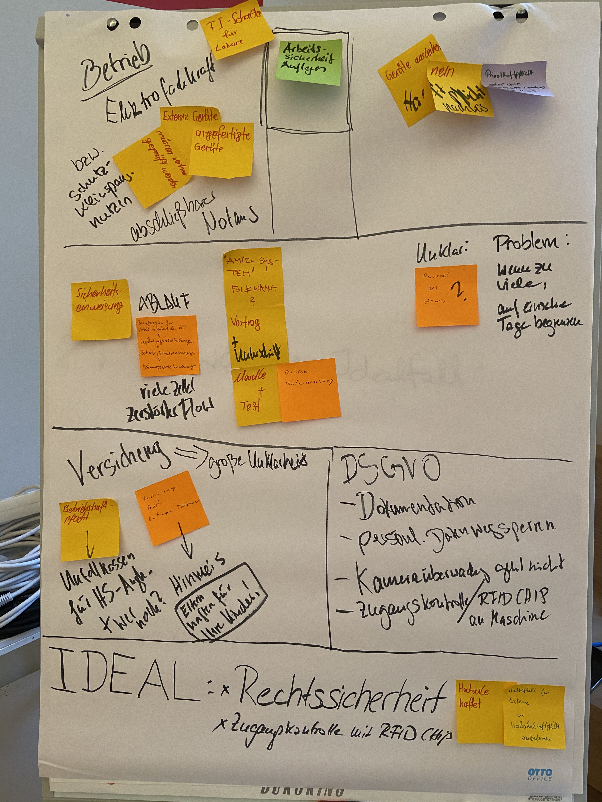

### Forschung und Dokumentation

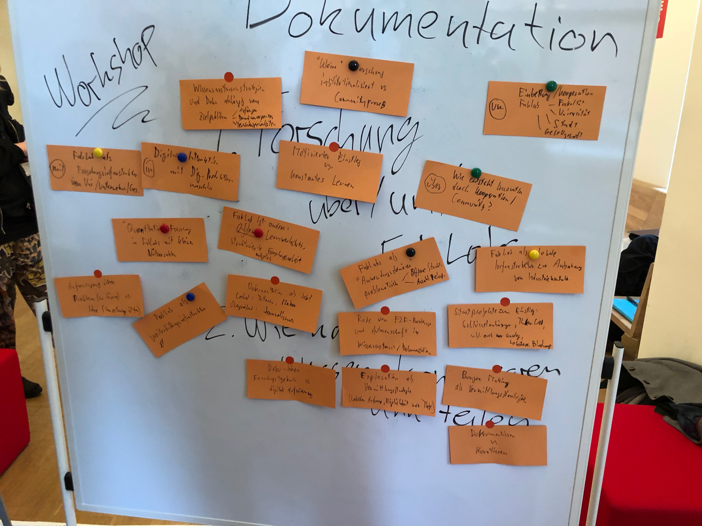

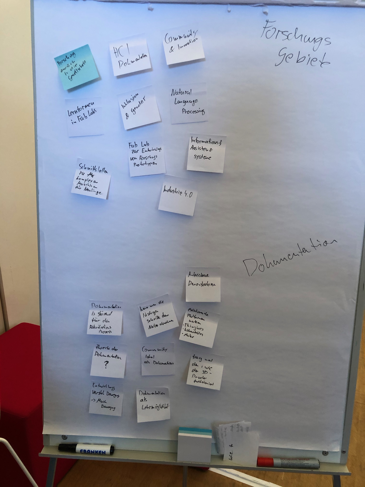

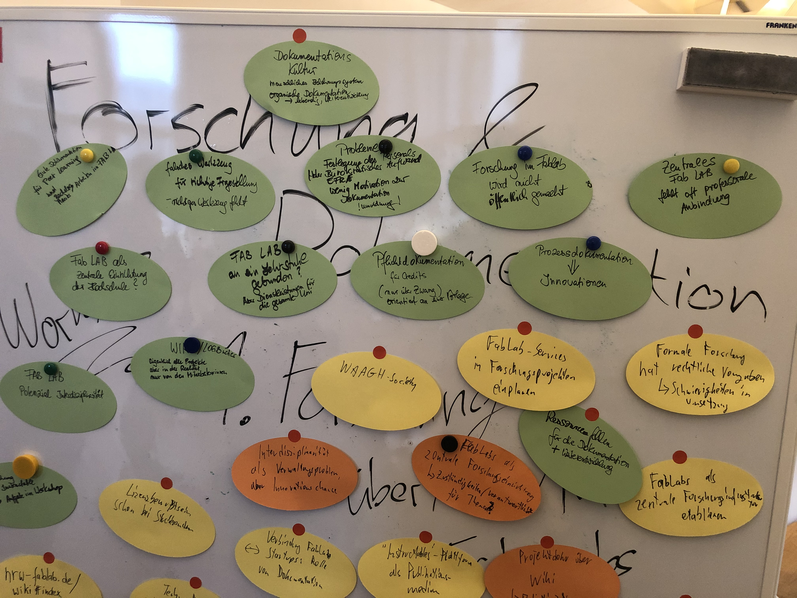

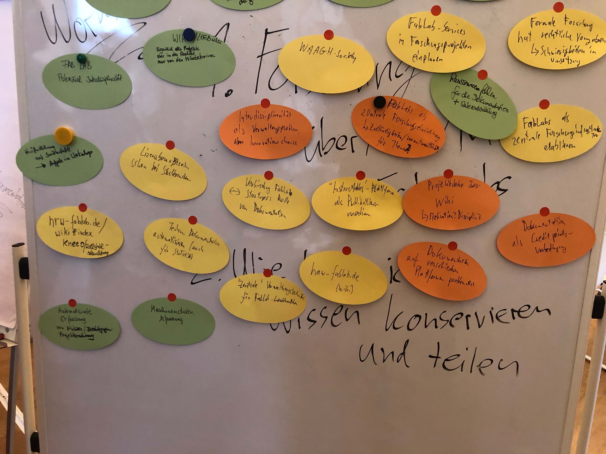

### Curriculum

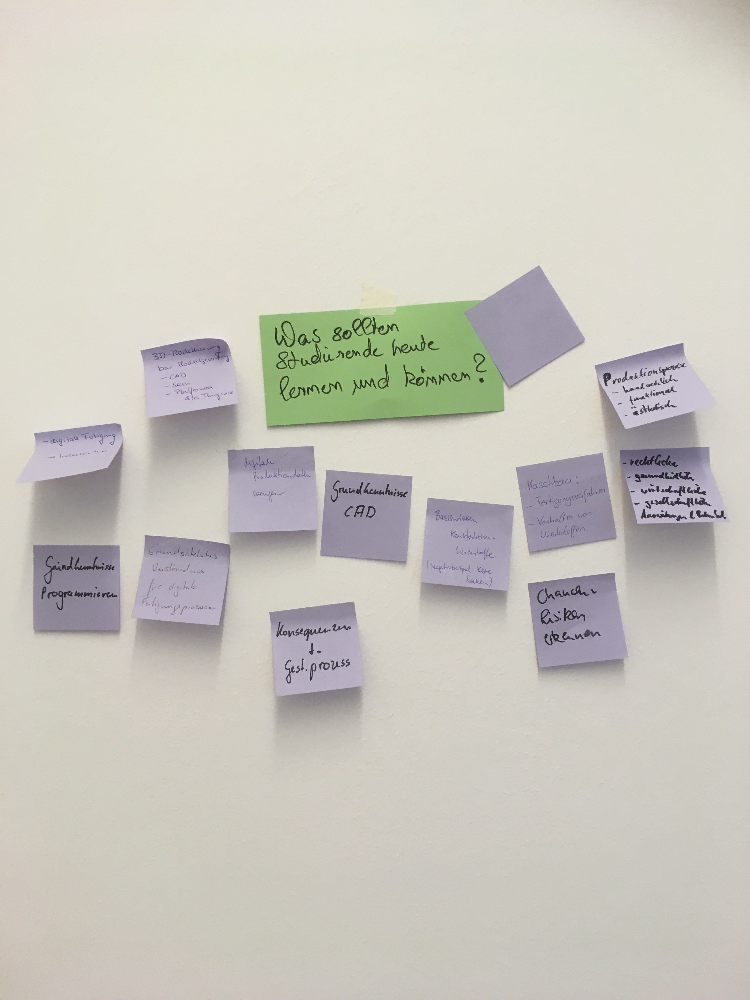

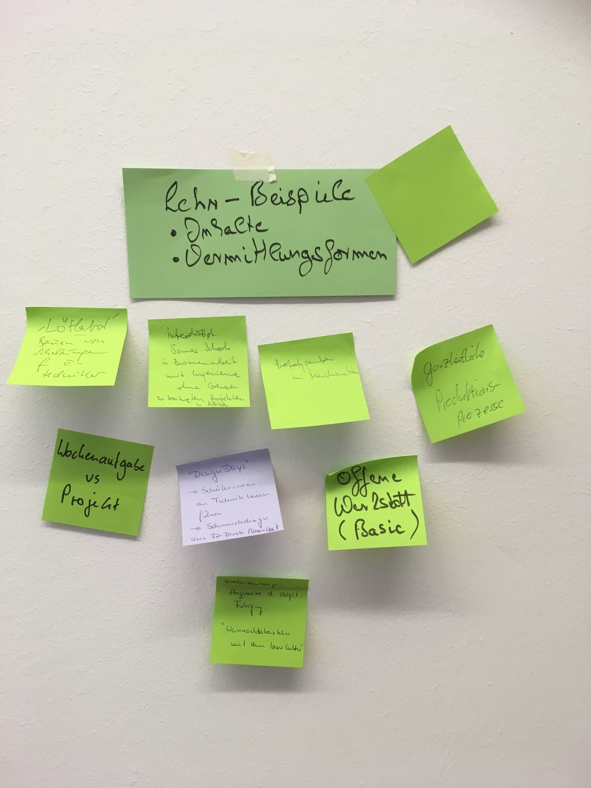

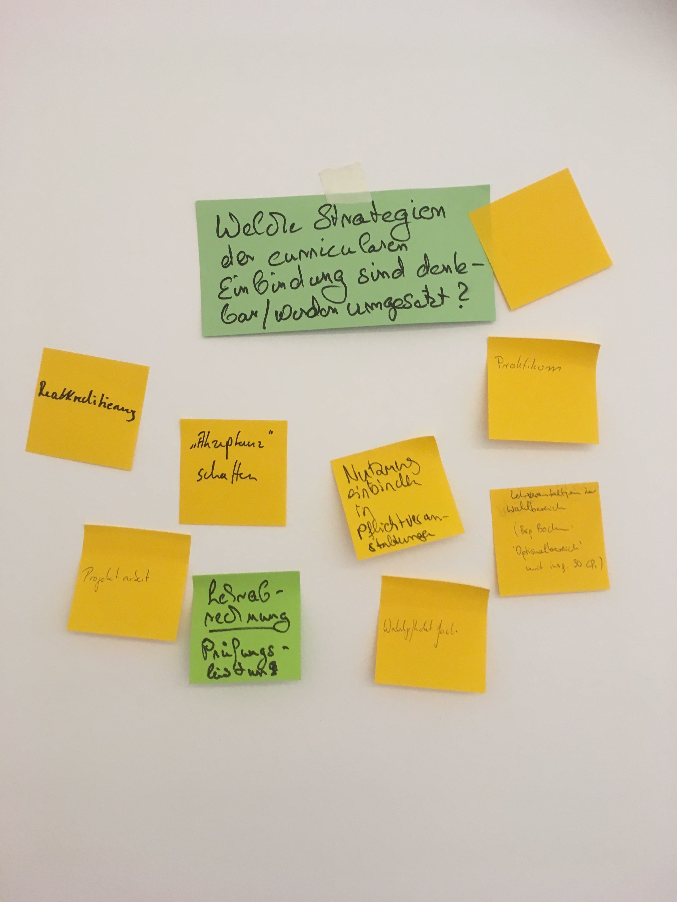

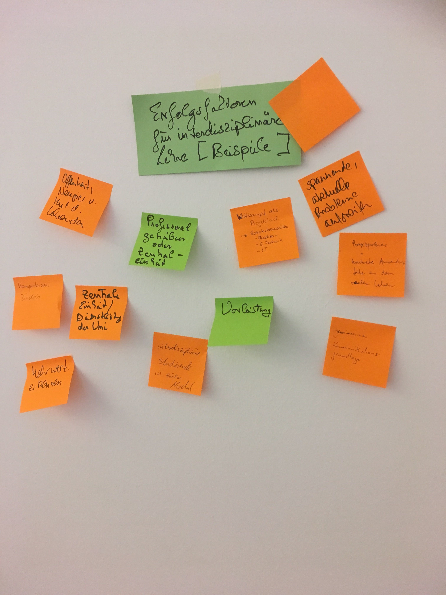

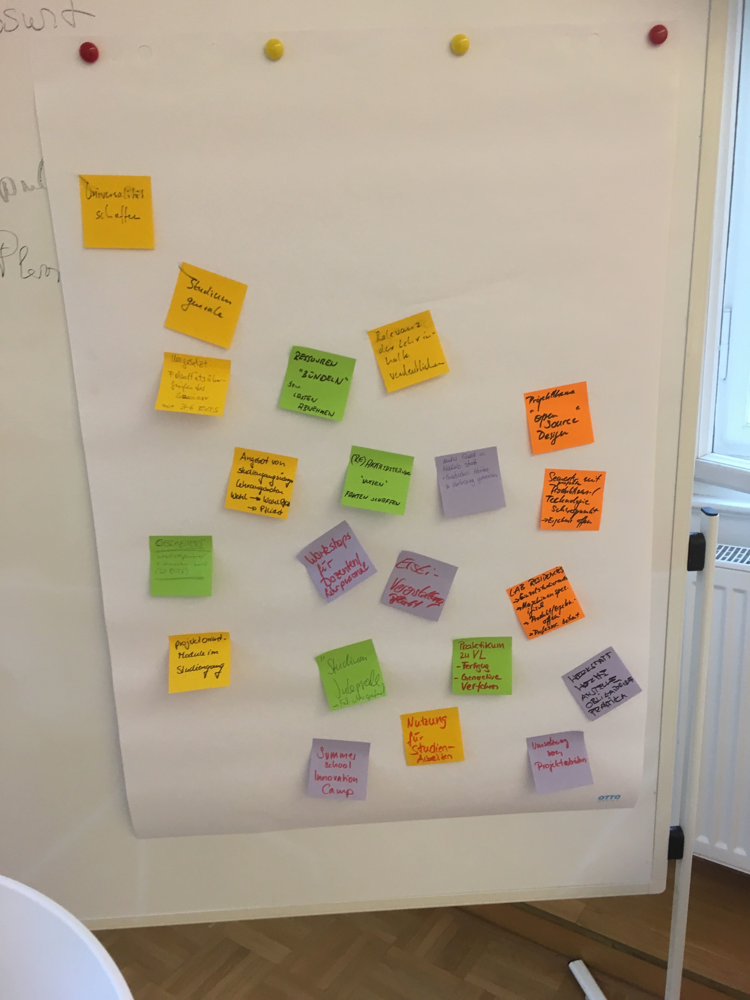

### Zukunft

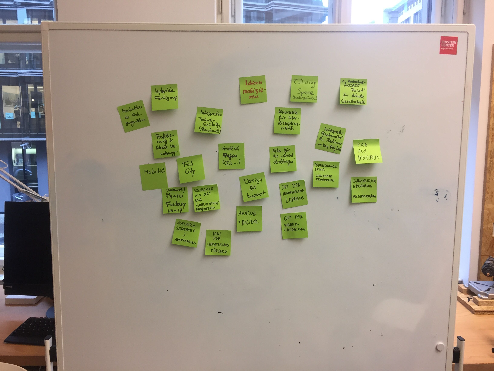

<a href="zukunft.pdf">PDF mit weiteren Ergebnissen</a>
