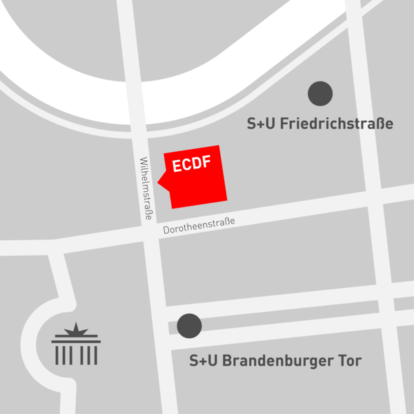

## Save the date! Fab:UNIverse 2019 am 6 November 2019 im ECDF in Berlin

Mit der Einrichtung und dem Betrieb von öffentlich zugänglichen Makerspaces, Fab Labs und ähnlichen Laboren im Hochschulkontext sind eine ganze Menge Herausforderungen verbunden. Dazu tauschen sich seit 2017 eine zunehmende Zahl an Vertretern solcher Orte in der jährlichen Veranstaltung Fab:UNIverse aus. Auch 2019 wollen wir wieder die Möglichkiet zu Vernetzung und Austausch von Hochschul (Fab) Labs bieten und diesmal die Ergebnisse des Forschungsprojektes FAB101 präsentieren und zur Diskussion stellen. 

Fab:UNIverse 2019 findet am 06.11.2019 ganztägig im Einstein Centre Digital Future (ECDF) im Herzen von Berlin statt. Aufgrund der begrenzten Plätze bitten wir um rechtzeitige *Anmeldung bis spätestens zum 15.09.2019* an [melanie.stilz@uni-siegen.de](mailto:melanie.stilz@uni-siegen.de). Hier könnt Ihr gerne auch noch eigene Vorschläge zum Programm einbringen! Ein vorläufiges Programm wird in Kürze veröffentlicht.

## Programm FabUNI:verse 2019

t.b.d.

##

**Datum: Mi. 06.11.2019**

Beginn: 10:00Uhr
Ende: 18:00Uhr

## Ort

06.11.2019 im [Einstein Center Digital Future](https://www.digital-future.berlin/ueber-uns/einstein-center-digital-future/).

**Anschrift:** Wilhelmstraße 67, 10117 Berlin

*Einstein Center Digital Future*

## Vorbereitung und Beiträge

t.b.c.

## Anmeldung

Wir bitten um *Anmeldung bis zum 15.09.2019* an [melanie.stilz@uni-siegen.de](mailto:melanie.stilz@uni-siegen.de). Hier könnt Ihr gerne auch noch eigene Vorschläge zum Programm einbringen!

## Organisation

