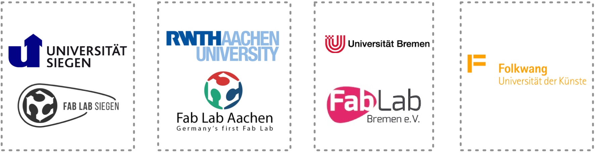

## Save the date - 06.11.2019

!!! important ""
    **Fab:UNIverse 2019 findet am 06. November 2019 im ECDF in Berlin statt!**  

## Hintergrund

Mit der Einrichtung und dem Betrieb von öffentlich zugänglichen Makerspaces, Fab Labs und ähnlichen Laboren im Hochschulkontext sind eine ganze Menge Herausforderungen verbunden. Dazu tauschen sich seit 2017 eine zunehmende Zahl an Vertretern solcher Orte in der jährlichen Veranstaltung Fab:UNIverse aus. Auch 2019 wollen wir wieder die Möglichkiet zu Vernetzung und Austausch von Hochschul (Fab) Labs bieten und diesmal die Ergebnisse des Forschungsprojektes FAB101 in Form eines Handbuchs für akademische Makerspaces präsentieren und zur Diskussion stellen.

Fab:UNIverse 2019 findet am 06.11.2019 ganztägig im Einstein Centre Digital Future (ECDF) im Herzen von Berlin statt. Aufgrund der begrenzten Plätze bitten wir um rechtzeitige *Anmeldung bis spätestens zum 15.09.2019* an [melanie.stilz@uni-siegen.de](mailto:melanie.stilz@uni-siegen.de). Am 5.11 ab 19h findet ein informelles Kennenlernen statt zu dem alle herzlich eingeladen sind, der Ort wird in Kürze bekannt gegeben.
Das vorläufige Programm:

## Programm 2019

**Datum: Mi. 06.11.2019**
Beginn: 9:00Uhr

| Zeit          | Programmpunkt          | 
| ------------- |:-----------------------| 
| 9:00          | Ankommen, Registrierung|
| 09:30         | Begrüßung              |
| 10:00         | Das Fab-Lab-Handbuch: Wie eröffnet man einen akademischen Makerspace? Kurze Vorstellung der einzelnen Kapitel             | 
| 11:00         | Kaffee Pause           |
| 11:15         | Workshop Phase I: drängende Fragen akademischer Makerspaces - was kann Das-Fab-Lab-Handbuch leisten?
| 12:30         | Mittagspause
| 13:30         | Workshop Phase II
| 15:30         | Kaffeepause
| 16:00         | Vorstellung der Ergebnisse
| 16:45         | Podiumsdiskussion: “Makerspaces als Hochschulinfrastruktur”
| 17:45         | Abschluss

Ende: 18:00Uhr

## Ort und Anfahrt

Im [Einstein Center Digital Future](https://www.digital-future.berlin/) Berlin.

**Anschrift:** Wilhelmstraße 67, 10117 Berlin

<iframe width="680" height="350" frameborder="0" scrolling="no" marginheight="0" marginwidth="0" src="https://www.openstreetmap.org/export/embed.html?bbox=13.376508951187136%2C52.515933591762696%2C13.384029865264894%2C52.520862660627735&amp;layer=mapnik&amp;marker=52.518398195318696%2C13.380269408226013" style="border: 1px solid black"></iframe> <small><a href="https://www.openstreetmap.org/?mlat=52.51840&amp;mlon=13.38027#map=17/52.51840/13.38027">View Larger Map</a></small>

## Vorbereitung und Beiträge

t.b.d.

## Anmeldung

Wir bitten um *Anmeldung bis zum 15.09.2019* an [melanie.stilz@uni-siegen.de](mailto:melanie.stilz@uni-siegen.de). Hier könnt Ihr gerne auch noch eigene Vorschläge zum Programm einbringen!

## Organisation

