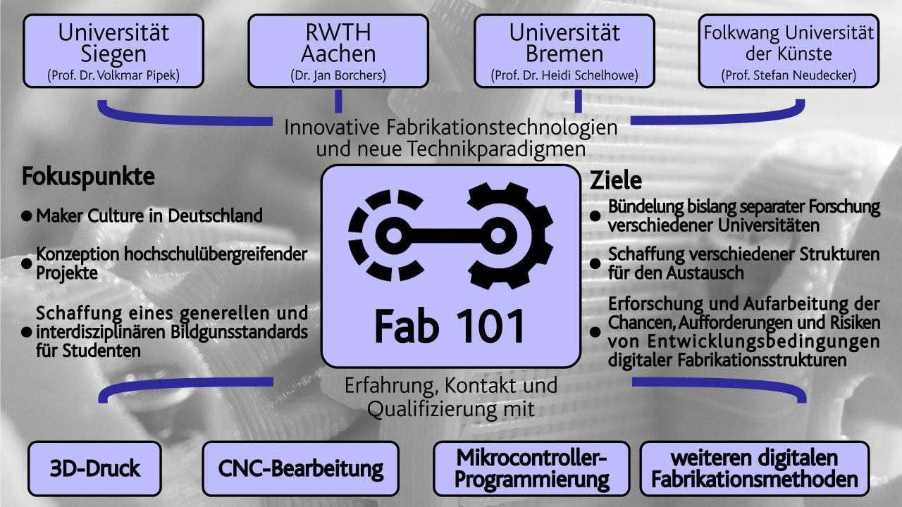

## Digitalisierung in der Hochschullehre: Das Forschungsprojekt “FAB101”

Aufgabe des Forschungsverbundes **Fab101** ist es - ausgehend von den jeweiligen Fab Labs an den beteiligten Hochschulstandorten - in interdisziplinärer Zusammenarbeit Konzepte zu einer studiengangs- und hochschulübergreifenden Lehre in Laboren zur Digitalen Fabrikation (Fab Labs) praxisnah zu beforschen. Das Projekt ist Teil der Digitalisierungsstrategien der jeweiligen Hochschulen.

Fab Labs sind Fabrikationslabore, in denen vorwiegend mit 3D-Druckern, Lasercuttern, Plottern, CNC-Fräsen und Mikrocontrollern gemeinsam gelernt, gearbeitet und geforscht wird.

Ergänzend werden im Projekt die strukturellen Rahmenbedingungen in den Blick genommen, wie zum Beispiel die organisations- und sicherheitstechnische Einbettung (neuartiger) Fab Labs an Hochschulen sowie die Erstellung von Empfehlungen für die hardware- und softwaretechnische Ausstattung.

# Projektstruktur

## Verbund und Förderer
Das Forschungsprojekt **Digitale Fabrikationsinfrastrukturen in der interdisziplinären Hochschulbildung - FAB101** wird von März 2017 bis Februar 2020 vom Bundesministerium für Bildung und Forschung gefördert. Am Verbund beteiligt sind die Universität Siegen (Verbundkoordination), die RWTH Aachen, die Universität Bremen und die Folkwang Universität der Künste.
